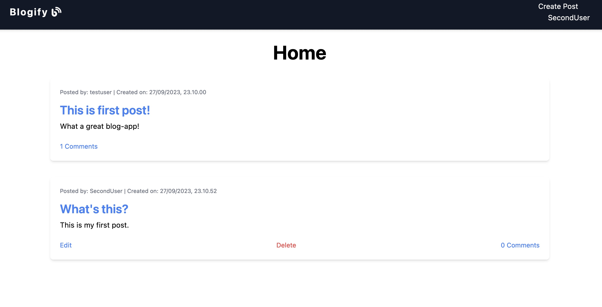
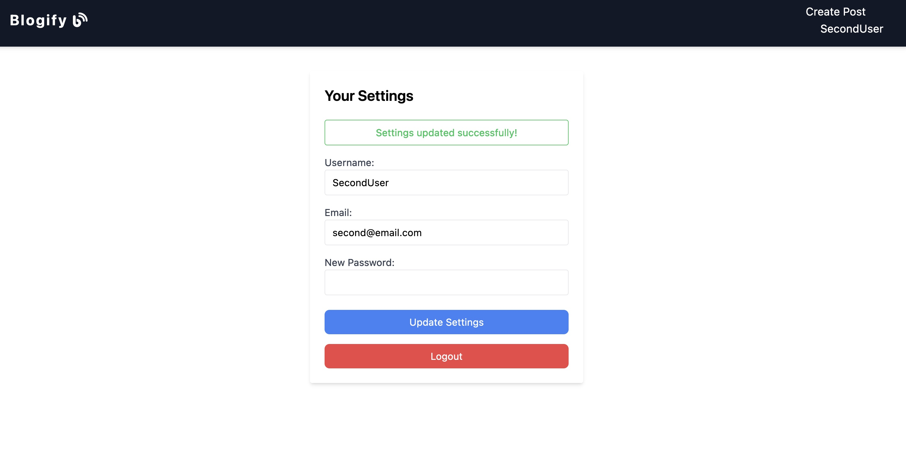
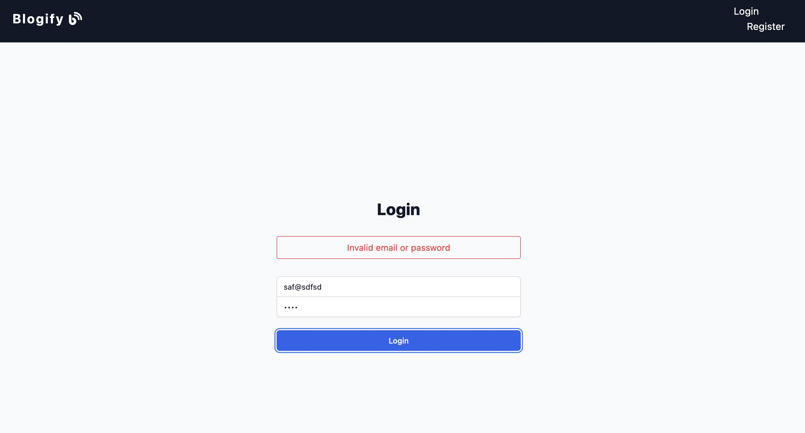

# Blog app

This project was built for fun and to delve deeper into the modern web development ecosystem. The technologies under the hood have been carefully chosen to deliver a modern, efficient, and robust experience.



## Tech Stack

- **Frontend**: React with Vite and TypeScript
- **Backend**: Node.js with TypeScript
- **Database**: PostgreSQL with Prisma ORM

## Features

- Seamless integration between frontend and backend.
- Efficient database operations using Prisma ORM.
- Robust and type-safe operations thanks to TypeScript.
- Rapid development and improved developer experience with Vite.

## Getting Started

```bash
git clone https://github.com/nikokarvinen/blog.git
```

2. **Install dependencies**:
   Navigate to the root directory and run:

```bash
npm install
```

3. **Start the Backend**:

```bash
npm run start
```

4. **Start the Frontend**:
   In a separate terminal window, navigate to the root directory and run:

```bash
npm run dev
```




